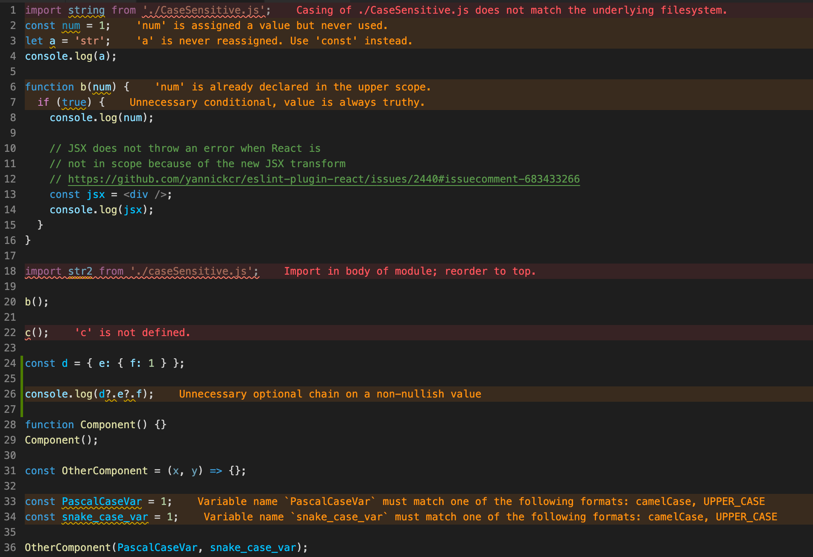

# UpLeveled ESLint Config

UpLeveled ESLint defaults for programming in JavaScript, TypeScript, React and Node.js.



## Setup

To add ESLint configuration to a project, install the dependencies and add the config files:

```sh
CI=true npx install-peerdeps@latest --yarn --dev @upleveled/eslint-config-upleveled
cp node_modules/@upleveled/eslint-config-upleveled/templates/{*,.eslint*} .
grep -Fxq ".eslintcache" .gitignore || printf "\n.eslintcache" >> .gitignore
grep -Fxq ".tsbuildinfo" .gitignore || printf "\n*.tsbuildinfo" >> .gitignore
```

If you have a monorepo using Yarn Workspaces and would like to install the config in the workspace root, change the first line to this:

```sh
CI=true npx install-peerdeps@latest --yarn --dev @upleveled/eslint-config-upleveled --extra-args "-W"
```

<!--

Old instructions

FIXME: Remove? Or restore once create-react-app v4 is out (with ESLint 7)?

## Setup

To add ESLint configuration to a project, the first steps are to install the dependencies and add the file:

```sh
yarn add --dev eslint-plugin-cypress eslint-config-react-app @typescript-eslint/parser
```

Then create a file in the root of your project called `.eslintrc.json` and add the content of [the `.eslintrc.json` file](https://github.com/upleveled/upleveled-vscode-eslint-base-config/blob/main/.eslintrc.json).

If you are using `create-react-app` in this project, this is enough! You're ready to go.

If the project doesn't use `create-react-app`, read on:

### Without `create-react-app`

With projects that don't use `create-react-app` (eg. Node.js or Next.js), then you will need to also run the following command:

<!--
  TODO: Fix this installation command when new CRA version comes out
  eg. npx install-peerdeps --dev --yarn eslint-config-react-app
  Ref: https://github.com/facebook/create-react-app/pull/9434#issuecomment-696566848
->

```sh
yarn add upleveled/eslint-config-upleveled
npx install-peerdeps --dev --yarn -o eslint-config-upleveled
yarn remove eslint-config-upleveled
```

-->

### Verify Setup

To verify that the configuration is working properly, you can try pasting the contents of [`__tests__/index.js`](./__tests__/index.js) into a new file and seeing whether you get the same warning messages as in the screenshot at the beginning of the readme (you may need to hover over the words underlined with orange / red squiggly lines).

## Alternative Global Installation (☢️ ☢️ ALPHA - may be unstable ☢️ ☢️)

‼️ **Warning:** Can potentially cause problems, since ESLint assumes local installation in a project: https://github.com/microsoft/vscode-eslint/issues/1073#issuecomment-694732656

If you would like to use the UpLeveled VS Code ESLint base configuration:

1. clone this repo to your projects directory
2. run `npm install` to install the dependencies
3. copy the following [`vscode-eslint`](https://marketplace.visualstudio.com/items?itemName=dbaeumer.vscode-eslint) configuration
4. open your `settings.json` in VS Code (<kbd>ctrl/cmd</kbd>-<kbd>shift</kbd>-<kbd>P</kbd> - "Open Settings (JSON)")
5. paste in the configuration and fix the paths to point at your directory

## Windows

```json
  "eslint.nodePath": "C:/Users/karl/projects/upleveled-vscode-eslint-base-config/node_modules",
  "eslint.options": {
    "configFile": "C:/Users/karl/projects/upleveled-vscode-eslint-base-config/.eslintrc.json",
    "resolvePluginsRelativeTo": "C:/Users/karl/projects/upleveled-vscode-eslint-base-config/node_modules"
  }
```

## macOS / Linux

```json
  "eslint.nodePath": "/Users/karl/projects/upleveled-vscode-eslint-base-config/node_modules",
  "eslint.options": {
    "configFile": "/Users/karl/projects/upleveled-vscode-eslint-base-config/.eslintrc.json",
    "resolvePluginsRelativeTo": "/Users/karl/projects/upleveled-vscode-eslint-base-config/node_modules"
  }
```
